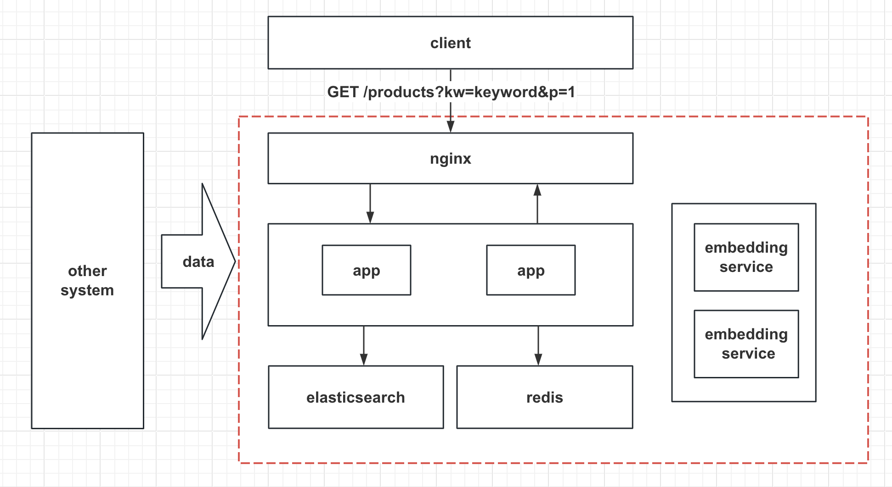

# Product Search API Specification

API documentation for the Product Search service.

## Architecture



### Assumptions

- The system implements the components within the red box in the architecture diagram. In a real production environment, the system is not standalone, and data is obtained from other systems through methods like message queues or REST APIs. The data processing part is not implemented in this feature but is done using scripts to fetch, process, and write data from a local CSV file.
- In a real-world scenario, multiple users might access the system. For simplicity, this system provides only one `api key` as user identification through environment variable configuration.
- In real environments, for scalability, performance, and reliability reasons, components of the system often use clustering. Complete systems with service registration and discovery are typical. For simplicity, this system obtains access addresses for dependent services through environment variable configuration.
- The matching implemented in this system is based on text search in an English language context, and support for other languages may not be comprehensive.
- In terms of business logic, the system matches keywords with product titles and does not extensively process product descriptions.
- In the data return process, a real system might return more information on various dimensions of products, involving a data caching step, which is not implemented in this system.

### Features

- Built on Elasticsearch, tokenizing and inverting the index for the title field to match user-input keywords.
- In cases where keywords are not present in the title, the system uses semantic search to find titles in the database semantically close to the keywords.
- The search interface provides pagination through request parameters. When there is no direct hit on keywords, it returns fuzzy results for up to 1 page of data.
- Rate limiting is applied; starting from the first visit, a limited number of requests are allowed within a given time interval. The interval duration and allowed number of visits can be configured via environment variables.

### Implementation

- The mentioned app uses Flask + Gunicorn to provide web services.
- The embedding service, based on TensorFlow Serving and Google's open-source universal-sentence-encoder model, provides text vectorization for semantic search support.
- Rate limiting is implemented using Redis for key expiration functionality.

> WARNING:
> Due to hardware limitations, this system has not undergone performance testing. Please refrain from using it in a production environment.

## Detailed Design

### API

#### Product Search API

```text
Path: /products?kw=some_name&p=1&_t=12345  
Method: GET 
Headers:
    Authorization: <api key> 
Query String: 
    kw: search keyword
    p: page number
```
Response:

```json
{
  "err_code": 0,
  "msg": "Success",
  "data": {
    "items": [
      {"id": "", "sku": "", "title": "", "description": ""},
      {"id": "", "sku": "", "title": "", "description": ""}
    ],
    "has_next": 1
  }
}
```

Response Status Code:

| Status Code | Description                             |
|-------------|-----------------------------------------|
| 200         | Successful                              |
| 403         | Permission denied, invalid API key      |
| 404         | URL not found                           |
| 400         | Bad request                             |
| 500         | Internal error                          |


Response Fields:

| Field                    | Data Type | Required | Description                 |
|--------------------------|-----------|----------|-----------------------------|
| err_code                 | integer   | Yes      | Error code, 0 for no error, others see common error code values |
| msg                      | string    | Yes      | Error description           |
| data                     | object    | Yes      | return data                 |
| data.has_next            | integer   | Yes      | Whether there is a next page: 1 - Yes; 0 - No |
| data.items               | array     | Yes      | List of products            |
| data.items[]             | object    | Yes      | Product item                |
| data.items[].id          | string    | Yes      | Product ID                  |
| data.items[].sku         | string    | Yes      | Product SKU                 |
| data.items[].title       | string    | Yes      | Product title               |
| data.items[].description | string    | Yes      | Product description         |

Common Error Codes:

| err_code   | description                                 |
|------------|---------------------------------------------|
| 40003      | Permission denied, invalid API key          |
| 40000      | Bad request                                |
| 40001      | Reached rate limit                         |
| 40040      | Not found                                  |
| 50000      | Internal error                             |


## Deployment

The following steps are suitable for local deployment based on Docker, assuming Docker is already installed.

- Clone the repository:

```shell
$ git clone https://github.com/zhangjpn/product-search.git
```

- Create directories:

```shell

cd product-search

# for elasticsearch data
mkdir -p data/elasticsearch/data

# for embedding model
mkdir -p data/models/embedding/1

# for redis persistent data
mkdir -p data/redis
```

- Download embedding model and extract model data:

```shell

wget "https://storage.googleapis.com/kaggle-models-data/1265/1497/bundle/archive.tar.gz"

tar -xvf archive.tar.gz -C data/models/embedding/1

```

- Set API key environment:

```shell
echo "SEARCH_API_KEY={you-api-key}" > env_file
```
Replace {your-api-key} with your own API key.

- Run Docker Compose:

This may take some time for Elasticsearch to initialize.

```shell
docker-compose --env-file env_file up -d 
```

- Initialize Elasticsearch index:

Once Docker Compose is successfully running, enter the product_app container to execute the program:

```shell
docker exec -it product_app sh
# execute script
python manage.py create_index

# exit docker shell
exit

```

- Ingest data:

Copy data into the product_app instance and execute the data ingest command:

```shell
docker cp </path/to/your-file.csv> product_app:/src

docker exec -it product_app sh

# in instance shell
python manage.py ingest --input <your-file.csv>

```
- Make a request:


```sh


curl -X GET http://localhost:8088/products?kw=ok&p=1 -H "Authorization: <api_key>"

```

Make sure to replace <api_key> in the above command with your own API key.

## Supplemental information

### Semantic Search

Semantic search is a way to improve search accuracy by understanding the meaning of words in a query rather than just matching keywords. Instead of relying solely on literal matches, semantic search considers the context, intent, and relationship between words to deliver more relevant results. It helps search engines comprehend user intent and provides better, context-aware search outcomes. This approach enhances the precision and efficiency of searches, making it a valuable tool for finding information in a more human-like manner.

Methods for semantic search typically involve transforming text into vector representations, where text with similar semantics becomes closer in vector space.

Universal Sentence Encoder is a pre-trained model open-sourced by Google, capable of encoding entire sentences into fixed-dimensional vectors. It employs deep learning techniques and, after being trained on large-scale text, possesses enhanced semantic understanding.

The following image shows how model works:


Visit [website](https://www.kaggle.com/models/google/universal-sentence-encoder) for more information.

